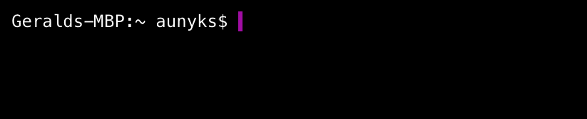

# mdlt - Metadelta CLI
**A command-line utility for quick math.**  
### What is it?
Mdlt is a lightweight command line tool that lets you perform arithmetic and symbolic math operations right from the terminal.

### Why this?
Well, nobody wants to boot Python, import SymPy, and type extraneous commands just to find a derivative. And, finding a decent website for math is quite a pain. *Mdlt just makes it too easy to do math!*

### How do I get started?
To install mdlt, simply run:
```
npm i -g mdlt
```
That's it! Now you can begin implementing Metadelta's powerful functionality right from the terminal!

### Okay and how do I use it?
Commands are formatted as such:
```
mdlt [operation] [expression]
```
Which means that you'd like metadelta to perform the given operation on the following expression.  
An example of this is:
```
mdlt derive x^2
```
which returns: `2 x`.  
For more commands, Mdlt's documentation can be found [here](https://github.com/aunyks/mdlt/blob/master/DOCS.md).
______________________________________________
Like mdlt? [Donate Bitcoin](https://coinbase.com/aunyks) to support development!  

Built using [metadelta](https://github.com/aunyks/metadelta-js)
Licensed under the GNU GPLv3 license.  

    Copyright (C) 2017  Gerald Nash

    This program is free software: you can redistribute it and/or modify
    it under the terms of the GNU General Public License as published by
    the Free Software Foundation, either version 3 of the License, or
    (at your option) any later version.

    This program is distributed in the hope that it will be useful,
    but WITHOUT ANY WARRANTY; without even the implied warranty of
    MERCHANTABILITY or FITNESS FOR A PARTICULAR PURPOSE.  See the
    GNU General Public License for more details.

    You should have received a copy of the GNU General Public License
    along with this program.  If not, see <http://www.gnu.org/licenses/>.
